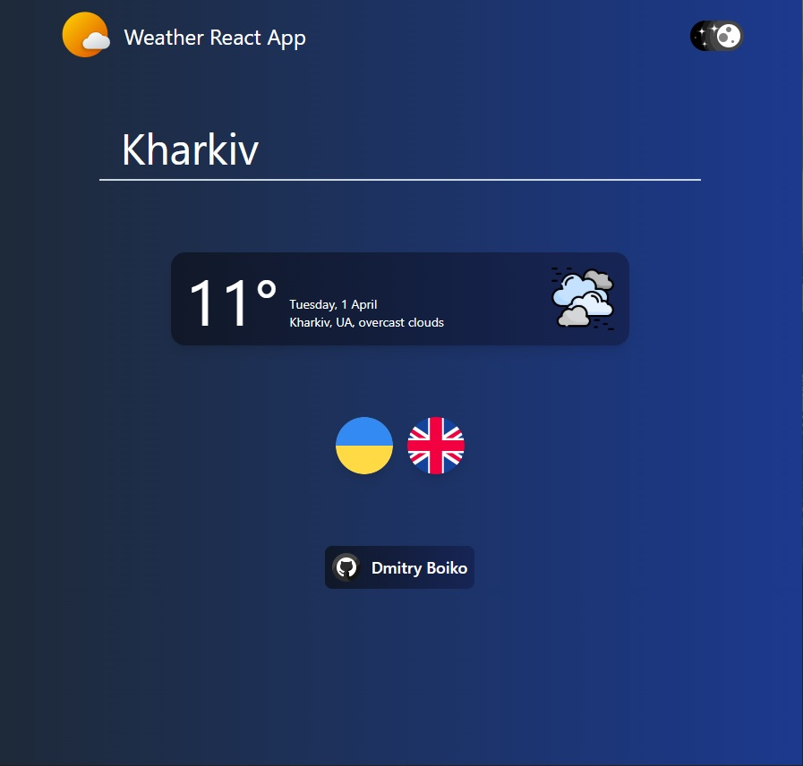

# React Weather App

## Description

This is a weather mini-app that displays real-time weather information for a selected city. It features a responsive design, adapting seamlessly to all devices. The application supports both light and dark themes, as well as two interface languages: English and Ukrainian. Built with HTML, Tailwind CSS, React, and TypeScript, it ensures a smooth and dynamic user experience, fetching weather data from the OpenWeather API.

## Technologies that have been used

- HTML5
- Tailwind CSS
- REACT
- TYPESCRIPT
- GIT
- VITE

## Instructions for working with the project

1. Cloning a repository. You need to write `git clone https://github.com/boikoua/react_weather-app` in terminal.

2. Go to the project folder `cd react_weather-app`.

3. Check the node version. The version of node should be `v20.x.x`. To do this, type the command `node -v` in the terminal.

4. Install dependencies. To do this, enter the `npm install` command.

5. Run the project. To do this, enter the `npm run dev` command.
   After that the project will be available to you at `http://http://localhost:5173/`.

## View project

> Link to the project
> [DEMO LINK](https://boikoua.github.io/react_weather-app/).

## Preview

